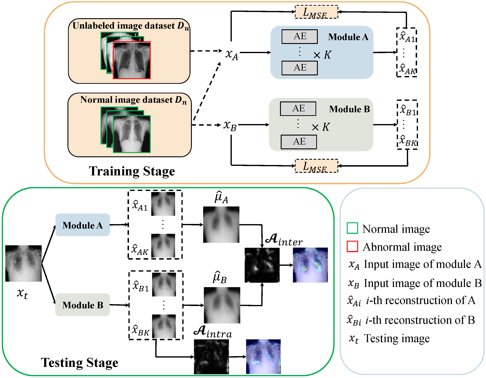

## DDAD (MICCAI 2022)
Our significant extension version of DDAD, named DDAD-ASR, is available at https://github.com/caiyu6666/DDAD-ASR

---


This is the PyTorch implementation of our paper: 

> **[Dual-Distribution Discrepancy for Anomaly Detection in Chest X-Rays](https://arxiv.org/pdf/2206.03935.pdf)** <br> [Yu Cai](https://caiyu6666.github.io/), [Hao Chen](https://cse.hkust.edu.hk/~jhc/), [Xin Yang](https://sites.google.com/view/xinyang/home), [Yu Zhou](https://www.vlrlab.net/~yuzhou), [Kwang-Ting Cheng](https://seng.hkust.edu.hk/about/people/faculty/tim-kwang-ting-cheng). <br>*International Conference on Medical Image Computing and Computer Assisted Intervention* (**MICCAI**), 2022, Early Accept.



### Requirements
* Python 3.6
* Pytorch 1.7.0
* tensorboard 2.5.0
* pillow 6.1.0
* pydicom 2.3.0 (for data preprocessing)

### Data Preparation

#### Option 1

Download the well-processed Med-AD benchmark from: [Google Drive](https://drive.google.com/file/d/1ijdaVBNdkYP4h0ClYFYTq9fN1eHoOSa6/view?usp=sharing) | [OneDrive](https://hkustconnect-my.sharepoint.com/:u:/g/personal/ycaibt_connect_ust_hk/EdCbKrjjRMlKi-1AotcAfkoB_jmbTQ2gnQChltgh7l8xVQ?e=t17t2S). <br>
(The benchmark is organized using 4 public datasets including RSNA and VinDr-CXR, and should be **only applied for academic research**.)

#### Option 2

1. Download the training dataset of [RSNA Pneumonia Detection Challenge](https://www.kaggle.com/c/rsna-pneumonia-detection-challenge) and [VinBigData Chest X-ray Abnormalities Detection](https://www.kaggle.com/c/vinbigdata-chest-xray-abnormalities-detection/data) challenge. Note that we only use their training set as labels of testing set are not available. 
2. Use `data/preprocess.py` to preprocess the two datasets respectively. The output files should be `*.png`.
3. Move the repartition files `rsna_data.json` and `vin_data.json` to corresponding data roots and rename to `data.json`.

The final structure of datasets should be as following:
```python
├─DATA_PATH
│ ├─rsna-pneumonia-detection-challenge   # data root of RSNA dataset
│ │ ├─train_png_512   # preprocessed images of rsna dataset 
│ │ │ ├─xxx.png
│ │ │ ├─ ......
│ │ ├─data.json   # repartition file of rsna dataset (renamed from "rsna_data.json")
│ ├─VinCXR   # data root of VinBigData dataset
│ │ ├─train_png_512   # preprocessed images of VinBigData dataset
│ │ │ ├─xxx.png
│ │ │ ├─ ......
│ │ ├─data.json   # repartition file of VinBigData dataset (renamed from "vin_data.json")
```

The `data.json` is a dictionary that storing the data repartition information:

```python
{
  "train": {
    "0": ["*.png", ], # The known normal images for one-class training
    "unlabeled": {
          "0": ["*.png", ], # normal images used to build the unlabeled dataset
    	  "1": ["*.png", ]  # abnormal images used to build the unlabeled dataset
    }
  },
  
  "test": {
  	"0": ["*.png", ],  # normal testing images
  	"1": ["*.png", ]  # abnormal testing images
  }
}
```

### Train and Evaluate
Train the reconstruction network for module A. (Repeat `K=3` times to obtain an ensemble of *K* networks.)
```
python main.py --config cfgs/RSNA_AE.yaml --mode a
```

Train the reconstruction network for module B. (Repeat `K=3` times to obtain an ensemble of *K* networks.)
```
python main.py --config cfgs/RSNA_AE.yaml --mode b
```

**Evaluation**

```
python main.py --config cfgs/RSNA_AE.yaml --mode eval
```

Each single reconstruction network can also be tested for comparison.
```
python main.py --config cfgs/RSNA_AE.yaml --mode test
```

**In total**, you can directly excute `./train_eval.sh` to train and evaluate the DDAD (AE) on RSNA dataset.

Different configuration files can be used for experiments on different datasets and different basic networks.

### AUC under different AR of unlabeled dataset
Experiments on RSNA dataset. AE is the basic network. 


### Histograms of anomaly scores
    


### Citation

If this work is helpful for you, please cite our paper:

```
@inproceedings{cai2022dual,
  title={Dual-Distribution Discrepancy for Anomaly Detection in Chest X-Rays},
  author={Cai, Yu and Chen, Hao and Yang, Xin and Zhou, Yu and Cheng, Kwang-Ting},
  booktitle={International Conference on Medical Image Computing and Computer-Assisted Intervention},
  pages={584--593},
  year={2022},
  organization={Springer}
}

@article{CAI2023102794,
title = {Dual-distribution discrepancy with self-supervised refinement for anomaly detection in medical images},
journal = {Medical Image Analysis},
volume = {86},
pages = {102794},
year = {2023},
issn = {1361-8415},
doi = {https://doi.org/10.1016/j.media.2023.102794},
author = {Yu Cai and Hao Chen and Xin Yang and Yu Zhou and Kwang-Ting Cheng},
}
```


### Contact

If you have any question, feel free to email [Yu Cai](mailto:yu.cai@connect.ust.hk).