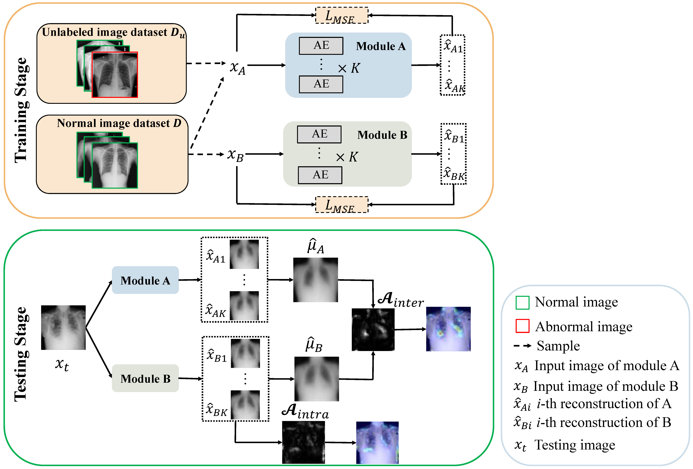
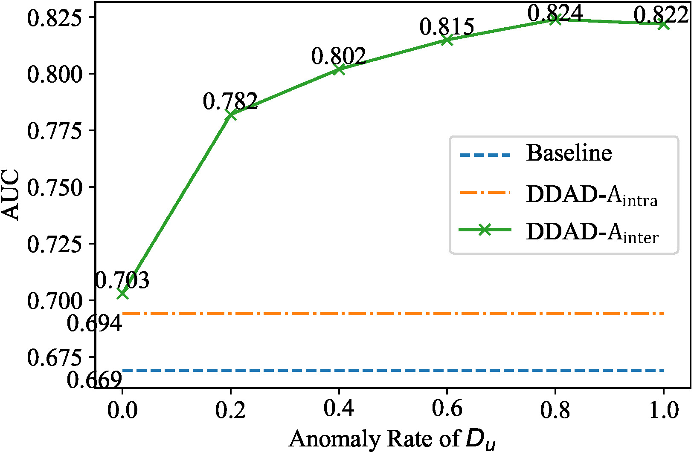
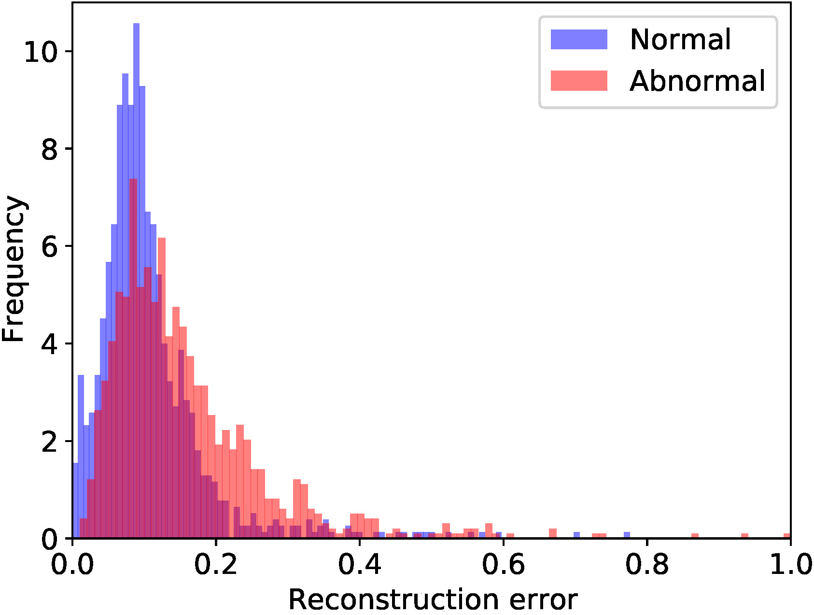
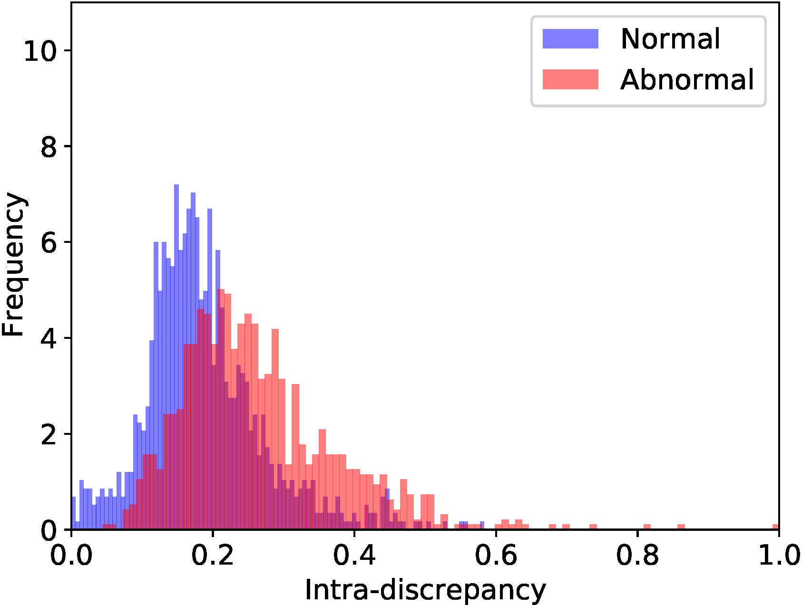
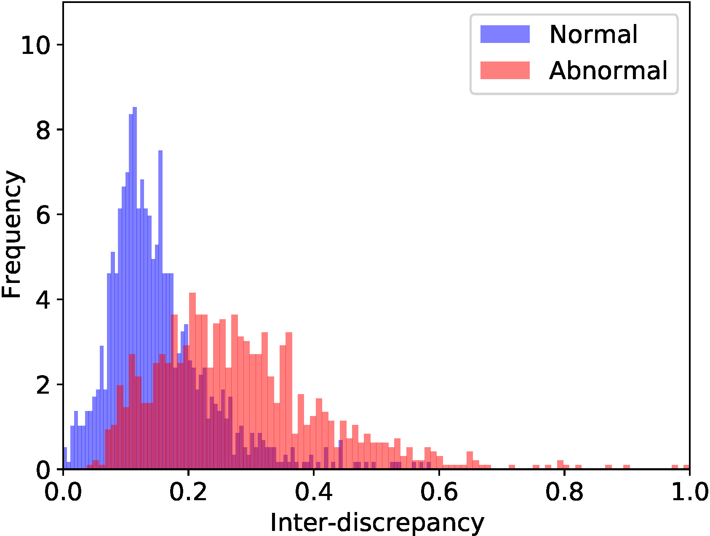

## DDAD (MICCAI 2022)
This is the PyTorch implementation of our paper: 

> Dual-Distribution Discrepancy for Anomaly Detection in Chest X-Rays. 
>
> Yu Cai, Hao Chen, Xin Yang, Yu Zhou, Kwang-Ting Cheng.

* *International Conference on Medical Image Computing and Computer Assisted Intervention* (MICCAI), 2022, Early Accept.



### Requirements
* Python 3.6
* Pytorch 1.70
* tensorboard 2.5.0
* pillow 6.1.0
* pydicom 2.3.0 (for data preprocessing)

### Data Preparation
1. Download the training dataset of [RSNA Pneumonia Detection Challenge](https://www.kaggle.com/c/rsna-pneumonia-detection-challenge) and [VinBigData Chest X-ray Abnormalities Detection](https://www.kaggle.com/c/vinbigdata-chest-xray-abnormalities-detection/data) challenge. Notice that we only use their training set as labels of testing set are not available. 
2. Use `data/preprocess.py` to preprocess the two datasets respectively. The output files should be `*.png`.
3. Move the repartition files `rsna_data.json` and `vin_data.json` to corresponding data roots and rename to `data.json`.

The final structure of datasets should be as following:
```
├─DATA_PATH
│ ├─rsna-pneumonia-detection-challenge   # data root of RSNA dataset
│ │ ├─train_png_512   # preprocessed images of rsna dataset 
│ │ │ ├─xxx.png
│ │ │ ├─ ......
│ │ ├─data.json   # repartition file of rsna dataset (renamed from "rsna_data.json")
│ ├─VinCXR   # data root of VinBigData dataset
│ │ ├─train_png_512   # preprocessed images of VinBigData dataset
│ │ │ ├─xxx.png
│ │ │ ├─ ......
│ │ ├─data.json   # repartition file of VinBigData dataset (renamed from "vin_data.json")
```

The `data.json` is a dictionary that storing the data repartition information:
```
data.json
├─train
│ ├─0   # The known normal images for one-class training
│ │ ├─xxx.png
│ │ ├─......
│ ├─unlabeled   # The unlabeled images used for proposed DDAD training (not all)
│ │ ├─0   # normal images used to build the unlabeled dataset
│ │ │ ├─xxx.png
│ │ │ ├─......
│ │ ├─1   # abnormal images used to build the unlabeled dataset
│ │ │ ├─xxx.png
│ │ │ ├─......
├─test
│ ├─0   # normal testing images
│ │ ├─xxx.png
│ │ ├─......
│ ├─1   # abnormal testing images
│ │ ├─xxx.png
│ │ ├─......
```

### Train and Evaluate
Train the reconstruction network for module A. (Repeat `K=3` times to obtain an ensemble of *K* networks.)
```
python main --config cfgs/RSNA_AE.yaml --mode a
```

Train the reconstruction network for module B. (Repeat `K=3` times to obtain an ensemble of *K* networks.)
```
python main --config cfgs/RSNA_AE.yaml --mode b
```

**Evaluation**
```
python main --config cfgs/RSNA_AE.yaml --mode eval
```

Each single reconstruction network can also be tested for comparison.
```
python main --config cfgs/RSNA_AE.yaml --mode test
```

**In total**, you can directly excute `./train_eval.sh` to train and evaluate the DDAD (AE) on RSNA dataset.

Different configuration files can be used for experiments on different datasets and different basic networks.

### AUC under different AR of unlabeled dataset
Experiments on RSNA dataset. AE is the basic network. 



### Histograms of anomaly scores
    


### Contact
If you have any question, feel free to email [Yu Cai](mailto:caiyu@hust.edu.cn).

